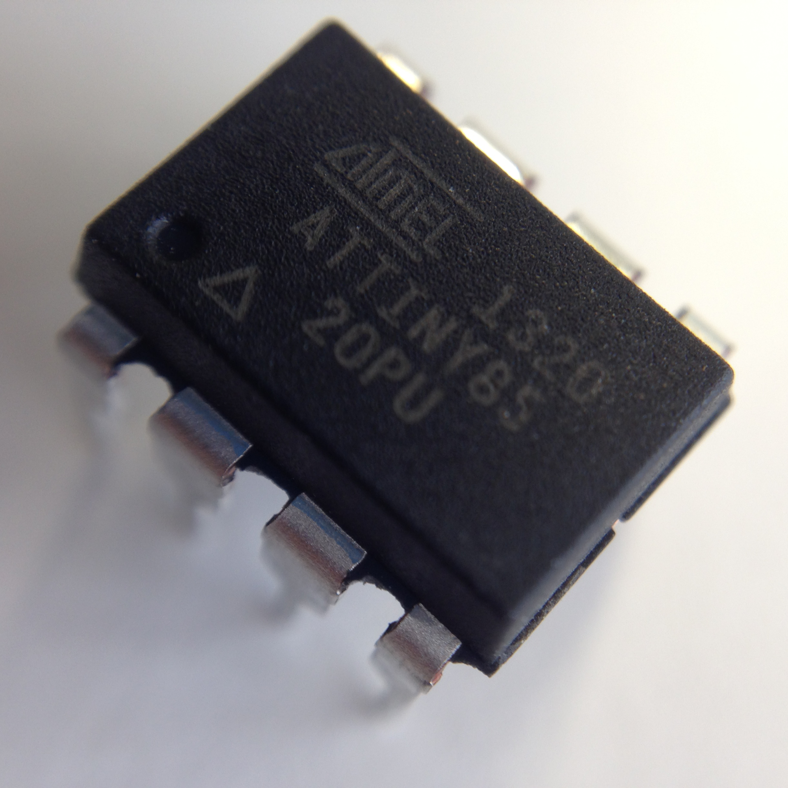
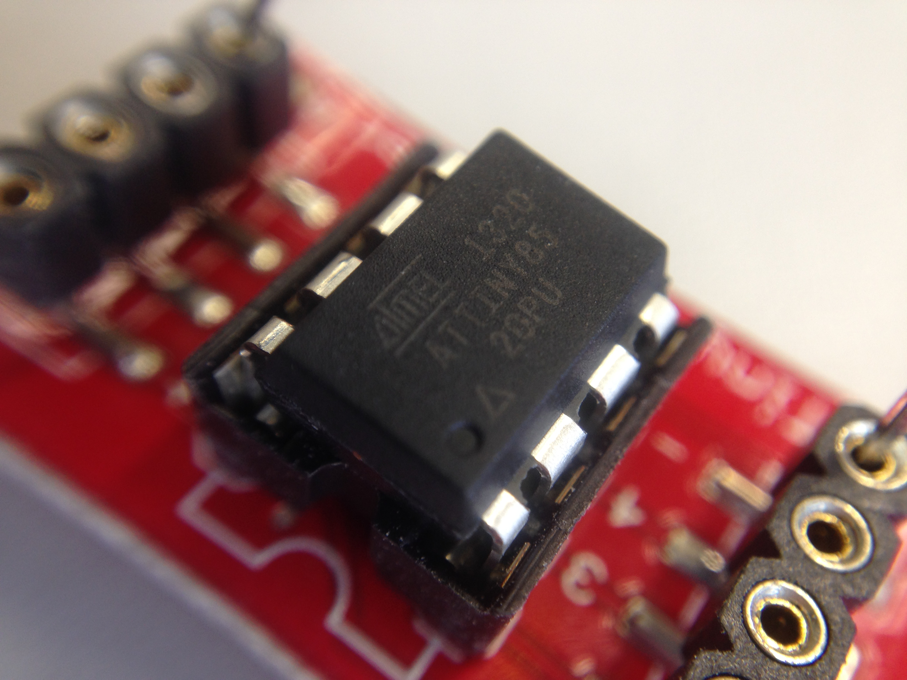

program-ATtiny 85-w-arduino-isp
==============================

  
__program ATtiny 85 with arduino isp__

To program a ATtiny 85 you need:
- Arduino IDE 0.22 (current 1.0.5 does not work)
- this hardware library http://highlowtech.org/?p=1229
(also in the repo. Thanks highlowtech group)
- a 10uf capacitor for preventing reset on programming
- an Attiny http://www.atmel.com/devices/attiny85.aspx
See the tutorials on how to set it up @ http://highlowtech.org/?p=1229

  
program ATtiny 85 with [Tiny Programmer](https://www.sparkfun.com/products/11460) 

If you don't want to use your Arduino board you can get one of these Tiny Programmers. It's a lot easier then the Arduino ISP way and works also with the latest Arduino IDE version. See the [hookup Guide by sparkfun](https://learn.sparkfun.com/tutorials/tiny-avr-programmer-hookup-guide/) and the [tutorial by the high low tech group](http://highlowtech.org/?p=1801)

##fritzing sketch by 2014 Fabian Moron Zirfas

##ATtiny library by high lowtech group

This program is free software; you can redistribute it and/or modify it under
the terms of the GNU General Public License as published by the Free Software
Foundation; either version 2.1 of the License, or (at your option) any later
version.  

This program is distributed in the hope that it will be useful, but WITHOUT
ANY WARRANTY; without even the implied warranty of MERCHANTABILITY or FITNESS
FOR A PARTICULAR PURPOSE. See the GNU General Public License for more details.  

You should have received a copy of the GNU General Public License along with
this program; if not, write to the Free Software Foundation, Inc., 59 Temple
Place, Suite 330, Boston, MA 02111-1307 USA  
